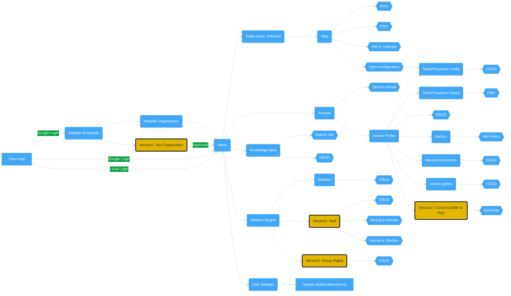

# UI Flow

## Good to know
* CRUD - All delete operations are using Soft Delete(data only marked as deleted)
* Some update operation may be == delete & create. For example in case of treatment(task) config,
where modifying treatment time cant change already finished previous tasks.

## Flow

