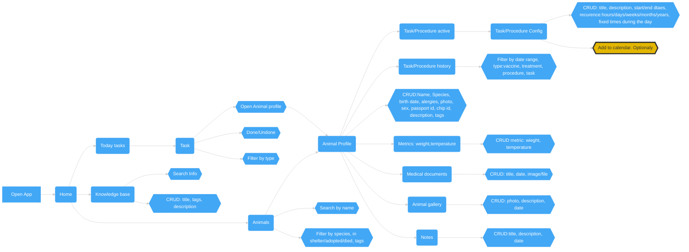

# UI Flow V1

## Good to know
* CRUD - All delete operations are using Soft Delete(data only marked as deleted)

### Tasks
The most complicated part. Tasks breaks on 2 data types: TaskConfig & Task.
Task config used to store task configuration, describing it. While Task is one of
many instance created based on task config. For example we set repeat some task
for a week. This should create 7 Tasks for each day. This is needed to have 
Task history, and see when tasks was done and when not.

This also mean that if we need to delete Task config & Tasks, we just remove future Tasks,
while past are saved. (this is the only place where we can hard delete data, as
future tasks are not needed). This also mean that update to Task Config need to
update all future Tasks or even delete & recreate future Tasks.

## Flow

